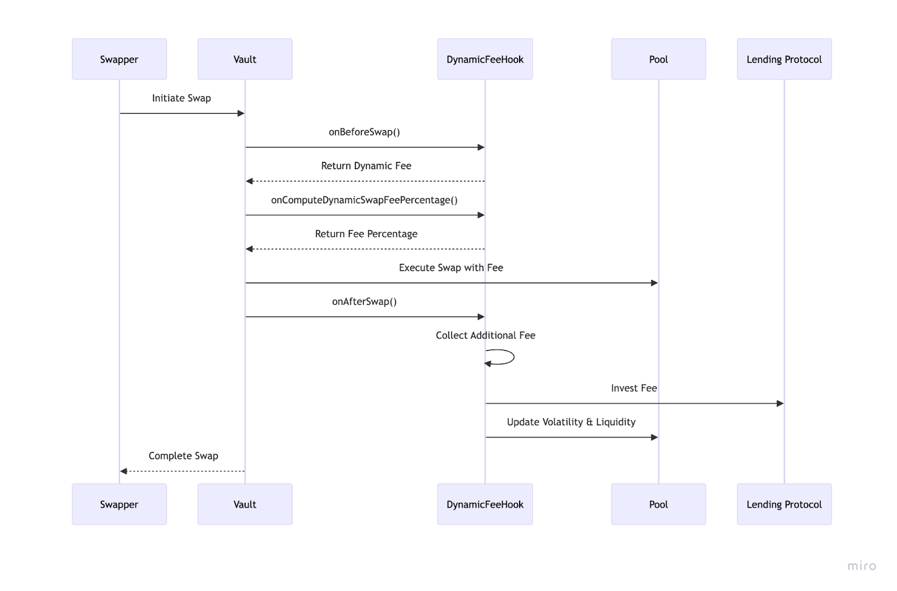
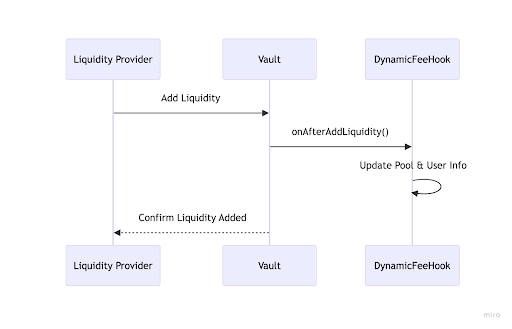
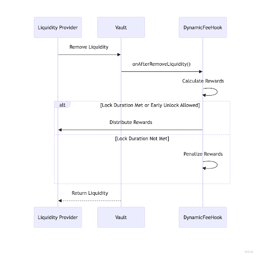
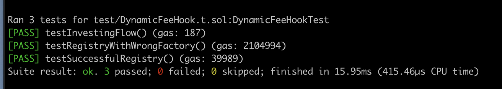

## Dynamic Fees and Reinvesting

The **Dynamic Fee Hook** contract is a smart extension to the Balancer protocol, created with the purpose of dynamically adjusting swap fees based on market conditions, specifically volatility and liquidity levels. This contract not only helps to stabilize the pools but also maximizes the rewards for those who provide liquidity. It brings benefits to both liquidity providers and token holders.

## How It Works:
### 1. Overview



### 2. Dynamic Fee Calculation:
- The contract continuously monitors the volatility and liquidity of each registered pool.
- Using predefined parameters, it calculates a dynamic fee for swaps. Higher volatility results in higher swap fees, which discourages excessive speculation and protects the pool from sudden, large fluctuations.
- The more volatility the more fee charged in the pool.
- The collected fees are not just taken out of circulation. Instead, they are invested in a lending protocol.

  

### 3. Liquidity Provider Incentives:
- Liquidity providers can add and remove liquidity at any time.
- Liquidity providers who lock their liquidity for a duration longer than the minimum lock duration set by the admin are rewarded with additional earnings.
- These earnings come from both the collected swap fees and the interest generated by investing those fees in the lending protocol.

    

### 4. Liquidity removal: 
- Providers who have locked their liquidity for the minimum duration receive their share of the collected fees and interest.
- Early withdrawers forfeit their rewards, which are redistributed among the remaining providers.

## Benefits:
- **Liquidity Providers**:
  - Increased Rewards: By participating in the pool and locking their liquidity for the set duration, providers earn a share of the collected fees, along with the interest earned from lending.
  - Stability and Confidence: The dynamic fee mechanism mitigates the impact of high volatility, resulting in a more stable pool. This stability attracts more liquidity providers, ensuring a healthy and robust liquidity environment.
- **Token Holders**:
  - Enhanced Pool Stability: As the dynamic fees curb excessive volatility, the pools become more stable, which in turn makes them more attractive for trading and investing.
  - Improved Liquidity: With more liquidity providers incentivized to join and stay in the pool longer, the overall liquidity in the pool increases, leading to better trading conditions and reduced slippage.
  - Increasing liquidity in lending markets.


## Conclusion:
In summary, the Dynamic Fee Hook contract is a powerful tool that benefits both liquidity providers and token holders. By intelligently adjusting fees based on market conditions, it ensures pool stability and incentivizes long-term participation. This results in a more resilient and liquid trading environment, ultimately enhancing the overall health of the Balancer ecosystem.

## Dev/X feedback:
The Balancer V3 Hookathon had well-written instructions that were very easy to follow. Balancer provided documentation and a video explaining how to create a new hook, which is a great resource for new users. We didn't need support, but when  Discord channel was checked,  the Balancer team was actively answering questions from other participants, which was helpful. We could learn from the answers, and it gave hackers the confidence that if a hacker needed help, the Balancer team would assist.

## How to build / test

### Build
```shell
$ forge build
```

### Test

```shell
$ forge test
```
    


### Gas Snapshots

```shell
$ forge snapshot
```
