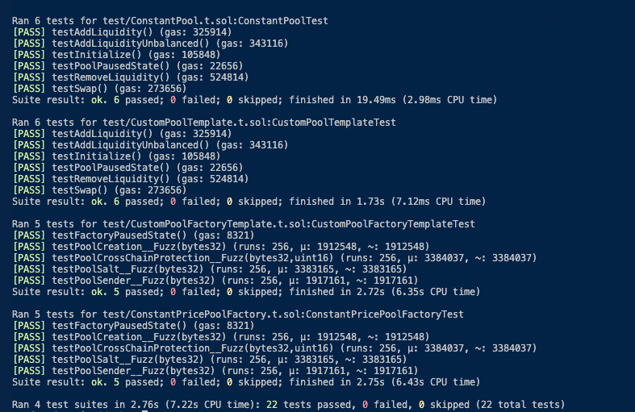

# 🏗 Scaffold-Balancer

⚖️ Balancer is a decentralized automated market maker (AMM) protocol built on Ethereum that represents a flexible building block for programmable liquidity.

🛠️ This repo is a series of guides and internal prototyping tools for creating custom pools that integrate with Balancer v3. It is based off of commit hash 4bc7978d8b8c4ac8e42c5a4adf233663b8390678 from the BalancerV3 monorepo. This repo is to be updated once the monorepo is fully public.

> 📚📖 PRE-REQs: It is highly recommended to read through the [BalancerV3 docs](https://docs-v3.balancer.fi/) before using this repo. Custom pools are built upon the architecture outlined within these docs. If you cannot find what you are looking for in the docs, and it is not in this README, please refer to the [BalancerV3 monorepo](https://github.com/balancer/balancer-v3-monorepo/tree/main) and/or reachout on the [Balancer Discord](https://discord.balancer.fi/).

🧑‍🏫 This guide walks through example contracts for a custom pool, custom pool factory, test files, and deployment scripts. These files are used to deploy an example BalancerV3 custom pool that can be interacted with using a test, local front-end, on a test network (by default it is a foundry fork of Sepolia). The repo also provides a starting point for developers to create their own custom pools and factories.

> When users clone this repo "off-the-shelf" they simply have to follow the environment setup instructions, run a few commands, and then they will have an example custom pool factory, and custom pools that they can interact with in a local front end.

Let's outline what this repo provides in more detail:

1. A README to walk a dev through using the different functionalities of the repo.
2. A front-end prototyping tool, example smart contracts and scripts, to help showcase simple integrations with Balancer's core architecture.
3. Use of the same front-end framework with your own custom pools, and walking you through how to do so using the example smart contracts and scripts to start.

## 🎥 Demo

👀 Watch this video to quickly get started with the full stack development environment 👇

[](https://www.loom.com/share/31cabf0568a845abadcbdbb0df416b20?sid=9b1176c7-5ee4-4feb-8b6e-c971721440a0)

👀 Watch this video to get better acquainted with the smart contracts 👇

[](https://drive.google.com/file/d/1x5IgDzKE2fQnpZdsfuLvb10c1OUAOH_z/view?usp=drive_link)

## 👨🏻‍🏫 Table of Contents

✏️ The Table of Contents of this README is listed below. Links are provided below in case you would like to jump to a certain topic.

0. **[Checkpoint 0](#🚨🚨-checkpoint-0-📦-environment-📚)** - 📚 Setup of the environment
1. **[Checkpoint 1](#🚨🚨-checkpoint-1-🏊🏻‍♀️-showcase-of-the-pool-explorer-with-se-2-tech-stack)** - 📚 Showcase of the front end actions w/ the repo off-the-shelf
2. **[Checkpoint 2](#🚨🚨-checkpoint-2-🌊-create-a-custom-pool)** - 🌊 Creating a custom pool smart contract.
3. **[Checkpoint 3](#🚨🚨-checkpoint-3-🔧-create-a-custom-pool-factory--interact-with-resultant-custom-pools)** - 🔧 Creating a custom pool factory, deploying it, and generating said pool from it that you can interact with using the front end in your local host.
4. **[Checkpoint 4](#🚨🚨-checkpoint-4-🧪-writing-typical-unit-and-fuzz-tests-for-custom-pool-example)** - 🧪 An Example of Writing Typical Unit and Fuzz Tests for a Custom Pool and Custom Pool Factory
5. **[Checkpoint 5](#🚨🚨-checkpoint-5-👩🏼‍🔬-creating-your-own-custom-pool-with-the-template-files)** - 🎨 Creating Your Own Custom Pool with the Template Files

In general, all smart contracts sections of this repo will already have `Example` smart contracts. These smart contract examples will be explained within this README.

---

## 🚨🚨 Checkpoint 0: 📦 Environment 📚

This section walks you through the set up of the repo environment so that you have a local front end with a foundry test fork off of Sepolia. The test fork will have deployed contracts to showcase how you can interact with custom pools in a test environment using the local pool explorer tab.

---

### 🔧 0.1 Requirements

Before you begin, you need to install the following tools:

- [Node (>= v18.17)](https://nodejs.org/en/download/)
- Yarn ([v1](https://classic.yarnpkg.com/en/docs/install/) or [v2+](https://yarnpkg.com/getting-started/install))
- [Git](https://git-scm.com/downloads)
- [Foundry](https://book.getfoundry.sh/getting-started/installation)

---

### 🏃🏻‍♀️ 0.2 Quickstart

Next, we will run the following bash commands in your terminal to clone the repo and set up the repo accordingly.

#### 0.2.0 Clone Repo

```bash
git clone https://github.com/Dev-Rel-as-a-Service/scaffold-balancer-v3.git
```

#### 0.2.1 Install Dependencies

```bash
yarn install
```

#### 0.2.2 Set Environment Variables

Set the following environment variables in a `packagages/foundry/.env` file

```
DEPLOYER_PRIVATE_KEY=0x...
ETHERSCAN_API_KEY=...
SEPOLIA_RPC_URL=...
```

- The `DEPLOYER_PRIVATE_KEY` must start with `0x` and will be referred to as 'DEPLOYER' throughout this README.
- The `ETHERSCAN_API_KEY` is used to conveniently verify contracts from the command line with `yarn verify`
- The `SEPOLIA_RPC_URL` facilitates running a local fork and sending transactions to sepolia testnet

#### 0.2.3 Start Local Fork

By default, this project runs on a local anvil fork of the Sepolia testnet.

```bash
yarn fork
```

#### 0.2.4 Deploy Contracts

All contracts are deployed from the wallet associated to the `DEPLOYER_PRIVATE_KEY` specified in the `.env`. By default, this wallet receives mock tokens and the resulting BPT from the pool initialization.

1. Deploy mock tokens and a pool factory using the `01_DeployFactory.s.sol` script

```bash
yarn deploy:factory
```

2. Deploy, register, and initialize a pool using the `02_DeployPool1.s.sol` script

```bash
yarn deploy:pool1
```

#### 0.2.5 Start Frontend

Execute the following command and then navigate to http://localhost:3000/pools

```bash
yarn start
```

You now should have a local, testnet fork with newly deployed smart contracts and a local front end communicating with said smart contracts. You can start interacting with the newly deployed pools and other smart contracts, but first let's talk about wallets and this tool.

---

### 🏗️ 0.3 Scaffold ETH 2 Configuration Guide

SE-2 offers a variety of full stack configuration options for connecting an account, choosing a network, and deploying contracts.

<details><summary><strong>0.3.1 Burner Wallet</strong></summary>

If you do not have a wallet already connected to your web browser and thus your local host, then you will automatically use a burner wallet. First, what is a burner wallet?

When connecting to a local node, SE-2 frontend randomly generates a burner wallet and saves the PK to your browser's local storage. When using the burner wallet, transactions will be instantly signed. This is useful for quick iterative development.

To force the use of burner wallet, disable your browsers wallet extensions and refresh the page. Note that the burner wallet comes with 0 ETH to pay for gas so you will need to click the faucet button in top right corner. Also the mock tokens for the pool are minted to your deployer account set in `.env` so you will want to navigate to the "Debug Contracts" page to mint your burner wallet some mock tokens to use with the pool.


</details>

<details><summary><strong>0.3.2 Browser Extension Wallet</strong></summary>

To use your preferred browser extension wallet, ensure that the account you are using matches the PK you previously provided in the `foundry/.env` file. As a convenience, the foundry deploy scripts max approve the vault contract to spend tokens.

⚠️ You may need to add a local development network with rpc url `http://127.0.0.1:8545/` and chain id `31337`. Also, you may need to reset the nonce data for your wallet exension if it gets out of sync.

</details>

<details><summary><strong>0.3.3 Deployment Details</strong></summary>

This command runs `DeployFactoryAndPool.s.sol` which deploys a pool factory, deploys mock tokens, deploys a pool, and initializes the pool. The factory contract and mock tokens will show on the "Debug" page. The pool contract address will print in the terminal, but can also be selected from the dropdown on the "Pools" page. All deployment configuration options are specified in `HelperConfig.s.sol`. You may need to refresh your front end in your local host after running the below command.

```bash
yarn deploy:all
```

This command runs `DeployPool.s.sol` using the last pool factory you deployed. You can copy and paste the address from terminal or refresh the pool explorer page and select it from the dropdown. All deployment configuration options are specified in `HelperConfig.s.sol`

```bash
yarn deploy:pool
```

> 🚗 Under the hood of SE-2: SE-2 is setup to hot reload the frontend with contracts that are directly deployed via the `DeployFactoryAndPool.s.sol` script. This means our frontend captures the pool factory and mock token contracts, but not the pool contract because it is deployed by calling a method on the factory.

</details>

<details><summary><strong>0.3.4 Changing The Frontend Network Connection</strong></summary>

The network the frontend points at is set via `targetNetworks` in the `scaffold.config.ts` file using `chains` from viem. By default, the frontend runs on a local node at `http://127.0.0.1:8545`

```typescript
const scaffoldConfig = {
  targetNetworks: [chains.foundry],
```

</details>

<details><summary><strong>0.3.5 Changing The Forked Network</strong></summary>

By default, the `yarn fork` command points at sepolia, but any of the network aliases from the `[rpc_endpoints]` of `foundry.toml` can be used to modify the `"fork"` alias in the `packages/foundry/package.json` file

```json
	"fork": "anvil --fork-url ${0:-sepolia} --chain-id 31337 --config-out localhost.json",
```

To point the frontend at a different forked network, simply change the `targetFork` in `scaffold.config.ts`

</details>

---

## 🚨🚨 Checkpoint 1: 🏊🏻‍♀️ Showcase of the Pool Explorer with SE-2 Tech Stack

You now should have a local front end started and test contracts deployed on a foundry test fork of the Sepolia network. This section simply highlights some of the actions you can take with the local front end.

---

### 🔍 1.1 Select Your Pool

On the "Pools" page, click the dropdown to select the custom pool you just deployed to your local anvil node.

<details><summary><strong>👀 See Pool Selection GIF</strong></summary>

https://github.com/Dev-Rel-as-a-Service/scaffold-balancer-v3/assets/73561520/cc358227-3bf6-4b02-8dc5-36577c0cbdcd

</details>

---

### 🚰 1.2 Use Your Pool

Connect the account you specified in the `.env` file using your favorite wallet extension and start splashing around in your pool by swapping, adding liquidity, and removing liquidity!

<details><summary><strong>👀 Swap Preview</strong></summary>


</details>

<details><summary><strong>👀 Add Liquidity Preview</strong></summary>


</details>

<details><summary><strong>👀 Remove Liquidity Preview</strong></summary>


</details>

---

### 🐛🙅🏻‍♂️ 1.3 Troubleshoot with the Debug Tab

Using the SE-2 toolkit, developers can troubleshoot with their smart contracts using the "Debug Tab" where they can see getter and setter functions in a local front end UI. As you saw earlier, we use this handy setup to mint `mockERC20` tokens to any connected wallet to our local host (it could be a foundry wallet, a burner wallet, your `.env` wallet, etc.).

<details><summary><strong>👀 Debug Preview</strong></summary>


</details>
<br>

At this point, you have now seen the capabilities of this repo and how it helps a developer (or team) onboard in building custom pools in BalancerV3.

🏎 Let's look under the hood, where we will start with understanding the example custom pool used within this repo., the `ConstantSumPool`.

---

## 🚨🚨 Checkpoint 2: 🌊 Create A Custom Pool

Ultimately, this repo can be used to create custom pool factories, custom pools from said factory, and register and initialize them so the pools can be interacted with using this repo's front end, all in a local environment. Before jumping into all of that, it is key that developers understand the general make-up of a custom pool.

Therefore, this checkpoint focuses on writing the smart contract for a custom pool (without a factory). We will walk through the `ConstantSumPool.sol` found within `packages/foundry/contracts/ConstantSumPool.sol`.

---

### 👘 2.1 Write a Custom Pool Contract

As a refresher, make sure to check out the [docs on creating custom pools as well](https://docs-v3.balancer.fi/concepts/guides/create-custom-amm-with-novel-invariant.html#build-your-custom-amm).

All custom pool contracts must inherit from `IBasePool` and `BalancerPoolToken` and implement the three required functions: `onSwap`, `computeInvariant`, and `computeBalance`.

Let's walk through each function in `ConstantSumPool.sol`

---

#### 2.1.1 `onSwap()` Implementation

Listed here for easy reference, the function discussed can also be found [here](https://github.com/Dev-Rel-as-a-Service/scaffold-balancer-v3/blob/1bb9e662e1f94bba7f30b7ad2a50bcee17ad9232/packages/foundry/contracts/ConstantSumPool.sol#L25C1-L26C1).

<details markdown='1'><summary>👩🏽‍🏫 Code for `onSwap` functions </summary>
Inside `ConstantSumPool.sol`

```
   /**
	 * @notice Execute a swap in the pool.
	 * @param params Swap parameters
	 * @return amountCalculatedScaled18 Calculated amount for the swap
	 */
	function onSwap(
		SwapParams calldata params
	) external pure returns (uint256 amountCalculatedScaled18) {
		amountCalculatedScaled18 = params.amountGivenScaled18;
	}

```

</details>

Looking at monorepo, one sees that `onSwap()` is ultimately called within a `swap()` call in the [`Vault.sol`](https://github.com/balancer/balancer-v3-monorepo/blob/9bc5618d7717dfbafd3cfbf025e7d3317ad7cacb/pkg/vault/contracts/Vault.sol#L327).

Essentially, the `onSwap()` call carries the custom pool logic that the vault queries to understand how much of the requested token the swap should return.

This step can vary between custom pool variations. To paint a contrast, a simple implementation can be seen within this `ConstantSumPool` example, where the amount swapped in is simply the amount swapped out (see toggle below).

Whereas you can begin to see the endless possibilities that exist when you take a look at the [WeightedPool implementation](https://github.com/balancer/balancer-v3-monorepo/blob/main/pkg/pool-weighted/contracts/WeightedPool.sol#L100-L126).

There you can see that the return value is dependent on the `SwapKind` and ultimately uses the `WeightedMath` functions to respect the invariant and other details for WeightedPools.

#### 🥅 ** `onSwap()` Goals / Checks**

- [ ] ❓ Can you describe how `onSwap()` works within the Balancer V3 monorepo architecture and thus how custom pools must accomodate said architecture?

---

#### 2.1.2 `computeInvariant()` Implementation

Listed here for easy reference, the function discussed can also be found [here](https://github.com/Dev-Rel-as-a-Service/scaffold-balancer-v3/blob/1bb9e662e1f94bba7f30b7ad2a50bcee17ad9232/packages/foundry/contracts/ConstantSumPool.sol#L39).

<details markdown='1'><summary>👩🏽‍🏫 Code for `computeInvariant()` function </summary>
Inside `ConstantSumPool.sol`

```
  /**
	 * @notice Computes and returns the pool's invariant.
	 * @dev This function computes the invariant based on current balances
	 * @param balancesLiveScaled18 Array of current pool balances for each token in the pool, scaled to 18 decimals
	 * @return invariant The calculated invariant of the pool, represented as a uint256
	 */
	function computeInvariant(
		uint256[] memory balancesLiveScaled18
	) public pure returns (uint256 invariant) {
		invariant = balancesLiveScaled18[0] + balancesLiveScaled18[1];
	}

```

</details>

This function is called throughout a number of sequences within the BalancerV3 architecture. Let's walk through one at a high-level.

By simply searching within the v3 monorepo, we can see that it is used within the [`Vault.sol`](https://github.com/balancer/balancer-v3-monorepo/blob/fd288fef56cbb20284d34c9b2b1d4227285922dc/pkg/vault/contracts/Vault.sol#L864) and other contracts relying on `BasePoolMath.sol`. Functions like [`computeRemoveLiquiditySingleTokenExactOut()`](https://github.com/balancer/balancer-v3-monorepo/blob/fd288fef56cbb20284d34c9b2b1d4227285922dc/pkg/solidity-utils/contracts/math/BasePoolMath.sol#L261) are inside `BasePoolMath.sol`. They call `computeInvariant()` to calculate the bptAmounts to be used within a respective transaction as well as the fees involved. Other primary contracts that rely on this function are: `VaultExtension.sol`, where it is used to calculate the bpt amounts involved when initializing a new pool.

Essentially, the invariant is used at different points of the transaction to ensure its mathematical logic is upheld within the respective pool. These of course can vary vastly based on the design that is taken. The most well-known invariant is the constant product invariant, as discussed within the BalancerV3 docs [here](https://docs-v3.balancer.fi/build-a-custom-amm/build-an-amm/create-custom-amm-with-novel-invariant.html#build-your-custom-amm:~:text=%23-,Compute%20Invariant,-Custom%20AMMs%20built) briefly.

For this example, the invariant is simply a constant sum invariant.

#### 🥅 ** `computeInvariant()` Goals / Checks**

- [ ] ❓ Can you describe how `computeInvariant()` works within the Balancer V3 monorepo architecture with the `Vault.sol`, `BasePoolMath.sol`, `VaultExtension.sol` and thus how custom pools must accomodate said architecture?

---

#### 2.1.3 `computeBalance()` Implementation

Listed here for easy reference, the function discussed can also be found [here](https://github.com/Dev-Rel-as-a-Service/scaffold-balancer-v3/blob/1bb9e662e1f94bba7f30b7ad2a50bcee17ad9232/packages/foundry/contracts/ConstantSumPool.sol#L55).

<details markdown='1'><summary>👩🏽‍🏫 Code for `computeBalance()` function </summary>
Inside `ConstantSumPool.sol`

```
  /**
	 * @dev Computes the new balance of a token after an operation, given the invariant growth ratio and all other
	 * balances.
	 * @param balancesLiveScaled18 Current live balances (adjusted for decimals, rates, etc.)
	 * @param tokenInIndex The index of the token we're computing the balance for, in token registration order
	 * @param invariantRatio The ratio of the new invariant (after an operation) to the old
	 * @return newBalance The new balance of the selected token, after the operation
	 */
	function computeBalance(
		uint256[] memory balancesLiveScaled18,
		uint256 tokenInIndex,
		uint256 invariantRatio
	) external pure returns (uint256 newBalance) {
		uint256 invariant = computeInvariant(balancesLiveScaled18);

		newBalance =
			(balancesLiveScaled18[tokenInIndex] +
				invariant *
				(invariantRatio)) -
			invariant;
	}

```

</details>

Looking at monorepo, one sees that `computeBalance()` is ultimately called to return the new balance of a token after an operation, given the invariant growth ratio and all other balances.
In this case, it is constant sum invariant that we simply need to create.

The docs outline how `computeBalance()` is used to return the needed balance of a pool token for a specific invariant change. So basically it is used to calculate an amount of a pool token when the resultant invariant is known. This can be seen in function calls within the v3 monorepo where expected balances are used to calculate the invariant ratio for liquidity operations such as that seen in functions [`_addLiquidity()`](https://github.com/balancer/balancer-v3-monorepo/blob/c009aa9217070e88ed3a39bda97d83c14342f39b/pkg/vault/contracts/Vault.sol#L630C1-L638C19) and [`_removeLiquidity()_`](https://github.com/balancer/balancer-v3-monorepo/blob/c009aa9217070e88ed3a39bda97d83c14342f39b/pkg/vault/contracts/Vault.sol#L850C13-L858C19).

To elaborate on things a bit further, within `Vault.sol`, two main internal functions use `computeBalance()`. These are: `_addLiquidity()` which calls upon , and `_removeLiquidity()` which calls upon `computeAddLiquiditySingleTokenExactOut()`, and `computeRemoveLiquiditySingleTokenExactIn()`, respectively. Within both of these sequences, the `computeBalance()` return value is used in calculating the eventual amount to debit (tokens marked as debt for the user as seen in `_takeDebt()` in the `VaultCommon.sol`) or credit (tokens marked as credit for the user as seen in `supplyCredit()` in the `VaultCommon.sol`) for the respective function call.

For the simple constant price pool example, we have a standard calculation of newBalance using the invariantRatio and current invariant.

#### 🥅 ** `computeBalance()` Goals / Checks**

- [ ] ❓ Can you describe how `computeBalance()` works within the Balancer V3 monorepo architecture and thus how custom pools must accomodate said architecture?

> 💡 Nice! We've now walked through a basic custom pool construction, let's get into how the custom pool factory contracts work.

---

## 🚨🚨 Checkpoint 3: 🔧 Create a custom pool factory && Interact with Resultant Custom Pools

Now that you have created a custom pool, it is time to deploy the associated custom pool factory. As outlined within the [docs](https://docs-v3.balancer.fi/build-a-custom-amm/build-an-amm/create-custom-amm-with-novel-invariant.html#deploy-your-pool:~:text=Creating%20pools%20via,%23), Balancer's off-chain infrastructure uses the `factory` address to ID the `type` of pool. For this repo, we've created a custom pool factory example and associated script to deploy it, and create a new pool using said factory.

In addition to being useful for integrating into Balancer, once the custom pool factory is deployed, anyone can come along and deploy more of that specific custom pool type, with varying pool parameters.

The example factory continues off of the previous section and uses `ConstantSumPool.sol` as the Custom Pool type. Within the script the first pool from said factory is deployed, registered, and initialized, so you can interact with it right away. Another script is created so you can create more pools and enter in the param details via your favorite code editor too.

This section will walk you through:

- Creating and Deploying the custom pool factory example.
- Running the script to deploy more pools from said custom pool factory.

---

## 🏭 3.1: Creating the Custom Pool Factory

We will focus on creating the `ConstantSumFactory.sol` contract. Let's focus on the constructor first.

Listed here for easy reference, the constructor discussed can also be found [here](https://github.com/Dev-Rel-as-a-Service/scaffold-balancer-v3/blob/1bb9e662e1f94bba7f30b7ad2a50bcee17ad9232/packages/foundry/contracts/ConstantSumFactory.sol#L22).

<details markdown='1'><summary>👩🏽‍🏫 Code for `constructor()` </summary>
Inside `ConstantSumFactory.sol`

```
constructor(
        IVault vault,
        uint256 pauseWindowDuration
    ) BasePoolFactory(vault, pauseWindowDuration, type(ConstantSumPool).creationCode) {
        // solhint-disable-previous-line no-empty-blocks
    }
```

</details>

It is used to deploy the `ConstantSumPool.sol` example custom pool we walked through earlier. It inherits the `BasePoolFactory.sol` from BalancerV3's monorepo.

For a factory associated to the `ConstantSumPool.sol` we do not need any extra implementation within the constructor. Thus, all we need to do is write the constructor with the appropriate params as described below for `BasePoolFactory.sol`.

1. `IVault vault` - The BalancerV3 vault on the respective network.
2. `uint256 pauseWindowDuration` - The pause window that will be used for all pools created from this factory. It is the timeframe that a newly created pool can be paused before its buffer endtime. Once a pool is paused, it will remain paused til the end of the pause window, and subsequently will wait til the vault's buffer period ends. When the buffer period expires, it will unpause automatically, and remain permissionless forever after.
3. `bytes memory creationCode` - The creation code that is used within the `_create()` internal function call when creating new pools. This is associated to the respective custom pool that you are looking to create.

> NOTE: more implementation can be input for the constructor for your own custom pool of course, but for this example we are keeping things simple. Even pools such as [WeightedPools](https://github.com/balancer/balancer-v3-monorepo/blob/9bc5618d7717dfbafd3cfbf025e7d3317ad7cacb/pkg/pool-weighted/contracts/WeightedPool8020Factory.sol#L21) and [StablePools](https://github.com/balancer/balancer-v3-monorepo/blob/main/pkg/pool-stable/contracts/StablePoolFactory.sol) can have simple constructor setups as seen in the v3 monorepo.

Moving on to the next part, the `create()` function is used to create new pools from the custom pool factory, adhering to the specific type of pools for said factory. In this case, that's the `ConstantSumPool`.

---

### 🧑🏻‍💻 3.1.1 `create()` Function

The `create()` function, in this simple example pool factory, simply calls the `_create()` function within the `BasePoolFactory.sol`. The `_create()` function uses `CREATE3`, similar to `CREATE2` to deploy a pool that has a pre-determined address based on its salt, and encoded creation code & args.

Listed here for easy reference, the the `create()` function discussed can also be found [here](https://github.com/Dev-Rel-as-a-Service/scaffold-balancer-v3/blob/1bb9e662e1f94bba7f30b7ad2a50bcee17ad9232/packages/foundry/contracts/ConstantSumFactory.sol#L42).

<details markdown='1'><summary>👩🏽‍🏫 Code for `create()` function </summary>
Inside `ConstantSumFactory.sol`

```
/**
     * @notice Deploys a new `ConstantSumPool`.
     * @param name The name of the pool
     * @param symbol The symbol of the pool
     * @param tokens An array of descriptors for the tokens the pool will manage
     * @param salt The salt value that will be passed to create3 deployment
     */
    function create(
        string memory name,
        string memory symbol,
        TokenConfig[] memory tokens,
        bytes32 salt
    ) external returns (address pool) {
        pool = _create(abi.encode(getVault(), name, symbol), salt);

        // Call registerPool from the vault. See `IVaultExtension.sol` for details on `registerPool()`
        getVault().registerPool(
            pool,
            tokens,
            getNewPoolPauseWindowEndTime(),
            address(0), // no pause manager
            PoolHooks({
                shouldCallBeforeInitialize: false,
                shouldCallAfterInitialize: false,
                shouldCallBeforeAddLiquidity: false,
                shouldCallAfterAddLiquidity: false,
                shouldCallBeforeRemoveLiquidity: false,
                shouldCallAfterRemoveLiquidity: false,
                shouldCallBeforeSwap: false,
                shouldCallAfterSwap: false
            }),
            LiquidityManagement({
                supportsAddLiquidityCustom: false,
                supportsRemoveLiquidityCustom: false
            })
        );

        _registerPoolWithFactory(pool); // register pool with respective factory (example facotry that was created in a previous tx, if using this repo it would've likely been from `DeployFactoryAndPool.s.sol` script being ran).
    }
```

</details>

Here is the `_create()` internal function for reference (it can also be found [here](https://github.com/balancer/balancer-v3-monorepo/blob/c009aa9217070e88ed3a39bda97d83c14342f39b/pkg/vault/contracts/factories/BasePoolFactory.sol#L86)):

<details markdown='1'><summary>👩🏽‍🏫 Code for `_create()` function </summary>
Inside `ConstantSumFactory.sol`

```
function _create(bytes memory constructorArgs, bytes32 salt) internal returns (address) {
        return CREATE3.deploy(salt, abi.encodePacked(_creationCode, constructorArgs), 0);
    }
```

</details>

Within the function `create()` we call `_create()` with appropriate params, which will be touched on later within our scripts. For now, we move onto the next aspect of the `create()` call, which is to `registerPool()` with the BalancerV3 vault.

---

#### 3.1.1.1 Calling `registerPool()`

New pools need to be registered to the BalancerV3 vault to operate within the BalancerV3 architecture. The details of this function are outlined well within the [`IVaultExtension.sol` natspec](https://github.com/balancer/balancer-v3-monorepo/blob/9bc5618d7717dfbafd3cfbf025e7d3317ad7cacb/pkg/interfaces/contracts/vault/IVaultExtension.sol#L53).

For the example factory contract we are working with, we have no pause manager, no hooks, and do not support "custom" liquidity provision or removal.

Finally, the `create()` function ends by calling `_registerPoolWithFactory(newPool)` (as seen [here](https://github.com/Dev-Rel-as-a-Service/scaffold-balancer-v3/blob/1bb9e662e1f94bba7f30b7ad2a50bcee17ad9232/packages/foundry/contracts/ConstantSumFactory.sol#L72)) which registers the new pool with the respective factory. This is done for accounting purposes, amongst other reasons.

> NOTE: like all other contracts and scripts within this repo, one must adjust aspects within this smart contract when creating their own type of custom pool.

---

## 🏭🧑🏻‍💻 3.2: Deploying the Custom Pool Factory

Now that we have created the `ConstantSumFactory.sol` contract, it is time to write the deployment scripts. We've provided example deployment scripts to reference as you create your own, and will walk through key gotcha's when writing your own deployment scripts. As always, test on your own before deploying!

`DeployFactoryAndPool.s.sol` is the file that we will use as a template, it can be found [here](https://github.com/Dev-Rel-as-a-Service/scaffold-balancer-v3/blob/1bb9e662e1f94bba7f30b7ad2a50bcee17ad9232/packages/foundry/script/DeployFactoryAndPool.s.sol).

For sake of simplicity, we will outline the core function of the script, and then explain specific gotchas with the script. The main one being the params involved with initialization.

---

### 💪🏼 3.2.1 Core Script Function

The script, using the `.env` specified deployer wallet, deploys the custom pool factory example we've just discussed. From there, it creates a new pool with it, registers the new pool with the BalancerV3 Vault on the respective network (default anvil fork of Sepolia), and initializes it. It does all of this so it is ready to use with the ScaffoldBalancer front end tool. The variables defined when calling Balancer functions, like `Router.intiialize()` are specific to the constant price custom pool setup, whereas if you are working with a more complicated pool setup you may want to adjust these params as necessary.

---

### 💡 3.2.2 Key Gotchas

- Specific to this repo, the script `DeployFactoryAndPool.s.sol` inherits [`ScaffoldETHDeploy.s.sol`](https://github.com/Dev-Rel-as-a-Service/scaffold-balancer-v3/blob/1bb9e662e1f94bba7f30b7ad2a50bcee17ad9232/packages/foundry/script/ScaffoldETHDeploy.s.sol) and [`HelperConfig`](https://github.com/Dev-Rel-as-a-Service/scaffold-balancer-v3/blob/1bb9e662e1f94bba7f30b7ad2a50bcee17ad9232/packages/foundry/utils/HelperConfig.sol)
- If using this and the associated deployment scripts to help troubleshoot your own custom pool type, then it is advised to use the `HelperConfig.sol` located at: `packages/foundry/utils/HelperConfig.sol`, to outline the appropriate details of your custom pool to use the already written example scripts within this repo.
- Balancer integration with `initialize()` has a couple of arrays that must match in terms of token ERC20 we are using, and the amounts of said token.

> It is key to understand that the script is calling [`Router.initialize()`](https://github.com/balancer/balancer-v3-monorepo/blob/c009aa9217070e88ed3a39bda97d83c14342f39b/pkg/interfaces/contracts/vault/IRouter.sol#L39C5-L56C55) ultimately, and so understanding this function call and its params is crucial. See the BalancerV3 monorepo for more info. We touch on some of these params below, but the nat spec is also a great resource.

- Some variables have comments on them to assist, such as the custom pool factory
- This script uses MockToken contracts to instantly mint 1000 of each test token to deployer wallet.
- The TokenConfig struct is defined within [`VaultTypes.sol`](https://github.com/balancer/balancer-v3-monorepo/blob/c009aa9217070e88ed3a39bda97d83c14342f39b/pkg/interfaces/contracts/vault/VaultTypes.sol#L128) in the v3 monorepo. It has a few gotchas:
  - `TokenConfig.tokenType` is an enum: `STANDARD` OR `WITH_RATE`
  - `TokenConfig.token` is the token address
  - `TokenConfig.rateProvider` is the rate provider for the respective token. Rate Providers are not needed for `STANDARD` tokenTypes. These also are not yield bearing.
  - `TokenConfig.payYieldFees` is a flag marking whether yield fees are charged on this token. As per BalancerV2, all yield bearing tokens had to have a yieldFee.
- Salt is typically the name of the respective pool. This way deployment of said pool can be the same across other networks too as per typical use of `CREATE2` and `CREATE3`.
- `exactAmountsIn[]` are subject to the details of TokenConfig, specifically the `tokenType` and `rateProvider`
- `userData` is for additional (optional) data required for adding initial liquidity.
- Sender must approve transferrance/handling of its tokens with the router and vault
- New pool must approve transferrance/handling of these specific tokens via router and vault.
- New Custom Pool Factory address is console logged to be used with `DeployCustomPoolFromFactoryExample.s.sol`
- As per the high-level BalancerV3 architecture, the `Router` is the main integration entrypoint to the Balancer system. Thus, `Router.initialize()` is called to subsequently call the vault to initialize a new pool within the system.

Cool, now we have these gotcha's understood with the script. We can move on to simulating and deploying!

---

### 🤖 3.2.3: Interacting with the Custom Pool Factory via Scripts

As seen in the beginning of this [README](#024-deploy-contracts), this repo comes with bash commands to deploy the discussed smart contracts on a local anvil fork of the Sepolia test network. For quick reference, here are the commands again:

> If you would like to change the network the local node is forking, [review this section.](https://github.com/Dev-Rel-as-a-Service/scaffold-balancer-v3/tree/main?tab=readme-ov-file#%F0%9F%9A%A8%F0%9F%9A%A8-checkpoint-4-%F0%9F%A7%AA-writing-typical-unit-and-fuzz-tests-for-custom-pool-example:~:text=0.3.4%20Changing%20The%20Frontend%20Network%20Connection)

To simulate deployment transactions on your local fork

```bash
forge script script/DeployFactoryAndPool.s.sol --rpc-url localhost
```

To send the deployment transaction to your local fork:

```bash
yarn deploy:all
```

To simulate deployment transactions on sepolia testnet:

```bash
forge script script/DeployFactoryAndPool.s.sol --rpc-url sepolia
```

To send the deployment transactions to sepolia testnet:

```bash
 yarn deploy:all —network sepolia
```

\*To simulate or deploy to a different network, swap out `sepolia` for any of the `[rpc_endpoints]` aliases listed in `foundry.toml`

> Of course, as stated numerous times in this repo, deployments and use of real in production smart contracts are the developer's responsibility and not the creators of this repo. Developers must use their own due diligence in creating extra tests, getting external audits, bug bounties, working with teams, etc.

---

## 🌊 3.3: Deploying Only A Pool

Now that the pool factory has been deployed to the local fork, we have the option to deploy just a new pool by calling the `create()` function on the previously deployed pool. Notice that the [`DeployPool.s.sol`](https://github.com/Dev-Rel-as-a-Service/scaffold-balancer-v3/blob/1bb9e662e1f94bba7f30b7ad2a50bcee17ad9232/packages/foundry/script/DeployPool.s.sol) script also registers and initializes the pool.

> NOTE: that the pool name will have to be different than that of the initial pool made within the `DeployFactoryAndPool.s.sol` commands.

To simulate the pool deployment on your local fork:

```bash
forge script script/DeployPool.s.sol --rpc-url localhost
```

To send the pool deployment transaction to your local fork:

```bash
yarn deploy:pool
```

At this point, the factory has been deployed, and you have deployed at least one more pool from the factory using the scripts within this repo. Again, if you want to specify a different network, reference the instructions outlined before.

> You can now interact with your custom pool just as the starter video showcased! Go out and have a good time. 😉

---

## 🚨🚨 Checkpoint 4: 🧪 Writing Typical Unit and Fuzz Tests for Custom Pool Example

At this point we've gone through how to make a simple custom pool and custom pool factory, and to simulate and/or deploy them on a testnet. Testing is of course needed, amongst many other security measures such as audits, for a custom pool implementation.

We will now walk through the testing contracts, provided as foundry test files. They are written for the Constant Price Custom Pool we use throughout this repo as an example.

> 🧠 These test files roughly mirror the typical testing cases that are found in the BalancerV3 monorepo for weighted pool factory tests. As a reference tool, it only makes sense to have tests that, at the very least, roughly mirror how weighted pool factories are tested within BalancerV3 monorepo.

> If you are unfamiliar with writing tests with foundry please check out their docs [here](https://book.getfoundry.sh/). Within the test files with this repo, we use fuzz testing, that the BalancerV3 monorepo also uses. Foundry docs on fuzz testing can be found [here](https://book.getfoundry.sh/forge/fuzz-testing).

To start, make sure you make your way to the proper path: `packages/foundry`. Run the following command to run the tests with this repo "off-the-shelf."

```
forge test
```

You should see the following test results in your terminal window.



These testing files can be used as a testing template, similar to how the smart contracts and scripts so far could be used as references or templates for your own custom pool implementation.

The tests that you see running are found in the following subdirectory / path: `packages/foundry/test`. There you will find test files, and template test files. The template files are simply copies of the test files but with comments outlining the details of each test, and marking variables to change out if you are using them as a starting template for your own tests.

> 🚨🚨 These files are not production ready, and it is the developer's responsibility to carry out proper testing and auditing for their pool.

---

### 🎨 4.1 [`CustomPoolTemplate.t.sol`](https://github.com/Dev-Rel-as-a-Service/scaffold-balancer-v3/blob/1bb9e662e1f94bba7f30b7ad2a50bcee17ad9232/packages/foundry/test/CustomPoolTemplate.t.sol)

#### 4.1.1 Inherited Context for `CustomPoolTemplate.t.sol` ([`BaseVaultTest.sol`](https://github.com/balancer/balancer-v3-monorepo/blob/c009aa9217070e88ed3a39bda97d83c14342f39b/pkg/vault/test/foundry/utils/BaseVaultTest.sol#L4) & [`BaseTest.sol`](https://github.com/balancer/balancer-v3-monorepo/blob/c009aa9217070e88ed3a39bda97d83c14342f39b/pkg/solidity-utils/test/foundry/utils/BaseTest.sol#L4))

The v3 monorepo has pool tests inheriting a base setup implemented within `BaseVaultTest.sol` & `BaseTest.sol`.

`BaseTest.sol` (Inherited by `BaseVaultTest.sol`)

- Creates test ERC20s (DAI, USDC, WETH, wstETH), test users (`admin`, `lp`, `alice`, `bob`, `hacker`, `broke`)
- Users created are dealt 1 million of each test ERC20
- Each test ERC20 has 18 decimals (compared to actual implementations such as USDC with 6 decimals)

`BaseVaultTest.sol`:

- Creates core architecture in a test environment: vault, vaultExtension, router, authorizer, pool, rateProvider
- Creates a mock pool with the vault
- Initializes pool with user `lp`

---

#### 4.1.2 Walking Through the `CustomPoolTemplate.t.sol`

Now that we understand the base `BaseVaultTest.setUp()` call made within the `CustomPoolTemplate.t.sol`, we can get into the actual template files.

Each test has comments added to them to help guide the developer with this starter test template. There are "TODO" comments added on several lines to assist users in creating their own custom pool tests for their own custom pool types they are working on. Of course, one has to update dependencies and other aspects as needed for their purposes.

---

### 🖼 4.2 [`CustomPoolFactoryTemplate.t.sol`](https://github.com/Dev-Rel-as-a-Service/scaffold-balancer-v3/blob/1bb9e662e1f94bba7f30b7ad2a50bcee17ad9232/packages/foundry/test/CustomPoolFactoryTemplate.t.sol)

Unlike the `CustomPoolTemplate.t.sol`, the `CustomPoolFactoryTemplate.t.sol` has a simpler setup where a mock vault, a custom pool factory (specific to the one that is being tested), and two test tokens are deployed.

Similar to the `CustomPoolTemplate.t.sol` file, the `CustomPoolFactoryTemplate.t.sol` file has "TODOs" to guide users in creating their own appropriate tests once they have a custom pool factory type of their own that they need to test.

---

## 🚨🚨 Checkpoint 5: 👩🏼‍🔬 Creating Your Own Custom Pool with the Template Files

This is just a guide, so please use your own due diligence with your project before deploying any actual smart contracts of course. This section will simply outlines key areas to look at updating if you are creating your own custom pool. Again, this is not the full extent that you should take to create your own custom pool, it is up to you and your team to carry out everything necessary (including but not limited to: testing, audits, etc.).

1. Rename custom pool and reconfigure it as needed for your own needs.
2. Update dependencies and details within solidity scripts found [here](packages/foundry/script) and mentioned inherited contracts.
3. Deploy, Register, and Initialize your custom pool using said scripts in #2. Interact with it to ensure it is functioning as you desire.
4. Simulate the deployment of your own custom pool factory, and interact with it to ensure it is functioning as you desire.
5. Write your own tests where you can use the test files within this repo as a starting point.

🎉🎉 Now you should have a custom pool and custom pool factory of your own, and have a better understanding of integrating with the new BalancerV3 tech stack. 🎊🥳

The next step is to reach out, if you haven't already, to the Balancer ecosystem via:

1. [Discord](https://discord.balancer.fi/)
2. [Balancer Grants](https://www.notion.so/Balancer-Grants-938f1b979810427f8d903a904315da41) if you've got an idea for a custom pool that you'd like to apply for a grant with.
