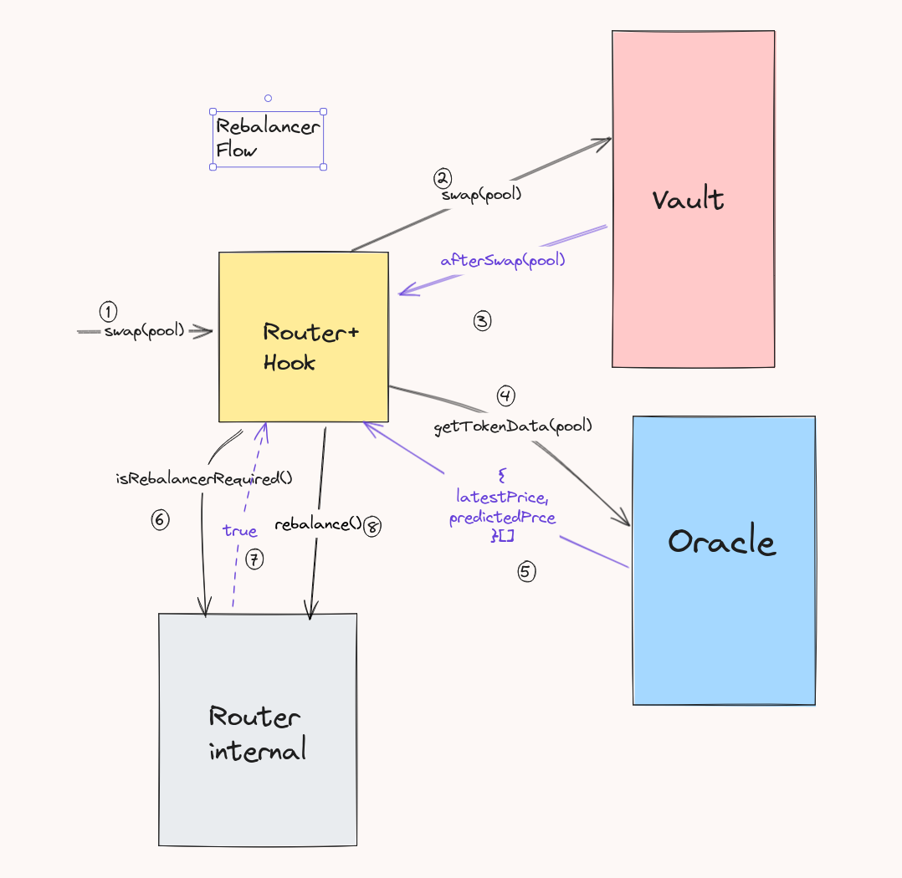

<div align="center">

  <a href="https://github.com/utkarshdagoat/KeyShard">
    
  </a>
<h3 align="center">ReBalancer</h3>
<p align="center">
ReBalancer is a balancer v3 hook that dynamically rebalances lp positions and fees based on real-time events and market implied volatility.
  <br />
  <a href="https://tome.app/some-e06/nonprofit-fundraising-pitch-copy-cm2i7ibns0n40524k04ggzjs0"><strong>The PitchDeck »</strong></a>
  <br />
  <br />
  <a href="https://vimeo.com/1021537547?share=copy">View Demo</a>
</p>
</div>

  ## The Motivation
  Volatility spikes are common during key real-world asset (RWA) events like central bank interest rate decisions, inflation reports (e.g., CPI), corporate earnings releases, bond coupon payments, and dividend announcements. Additionally, off-market hours in traditional finance and major geopolitical developments can drive price fluctuations. 
  RWAs that generate income, when these predictable price changes occur (like a bond's coupon payment), the value lost due to this change is permanent. That’s because the LP has effectively lost part of the asset’s value as it was transferred in the form of a coupon or dividend to the holder.
  As the value of RWA tokens is expecteed to cross $16 Trillion by 2030 said by [bcg](https://web-assets.bcg.com/1e/a2/5b5f2b7e42dfad2cb3113a291222/on-chain-asset-tokenization.pdf). Solving such a problem with balancer hooks can attaract LPs that provide such assets.

  ## The Problem
  Arbitrageurs capture all expected price and volatility changes at the expense of LPs. These predictable arbitrages harm liquidity, lead to MEV leaks, and deter swappers due to poor liquidity
  Let's look at an example
  Scenario: $1000 face value bond paying 5% semi-annual coupon
  Traditional AMM:
  - Bond token drops from $1000 to $950 after $50 coupon payment
  - LPs lose $50 per $1000 of liquidity
  - Arbitrageurs capture the entire coupon value

  ReBalancer Response:
  - Adjusts position bounds pre-coupon payment
  - Increases fees leading up to event
  - LPs capture 60-80% of would-be arbitrage profits
  ## Solution 
  A hook that dynamically optimizes LP fees and positions by leveraging forward-looking volatility for flexible fee adjustments, redirecting value from arbitrageurs to LPs, and using anticipated price movements to rebalance LP positions in advance.

  *ReBalancer* solves the problems by
  - Positions itself smartly in case of future events that leads to voltality of these assets.
  - Improve LP returns by dynamic rebalancing and fees.
  - Minimizes losses to arbitrages

  ## Implmentation
  As *ReBalancer* works on modifying and removing the liquidity it is both a *Hook* + *Router*.

  ### Architecture/Flow
  

  ### Math
  The math on a basic ideology is that we should keep the value functios same throught the price changes
  Let $V$ be the current value of the value function for are weighted pool. We know that it is calculate by
  $$
  \prod_{t} (B_{t})^{W_t}
  $$
  Where $B_{t}$ is the balance of token and $W_{t}$ is the normalized weight of the token.
  Let $P_t$ be the price of the token and $L$ is the liqudity of the pool. Then,
  $$
  B_t = \frac{L*W_t}{P_t}
  $$
  Now Due to a event the Price of each asset changes to $P_t'$. Resulting balance, liquidity and value function be given be $B_t'$ , $L'$ , $V'$.
  Now as
  $$V = V'$$
  $$\prod_{t} (B_{t})^{W_t} = \prod_{t} (B_{t}')^{W_t}$$
  $$\prod_{t} (\frac{L*W_t}{P_t})^{W_t} = \prod_{t} (\frac{L'*W_t'}{P_t'})^{W_t}$$
  which simplifies to assuming K tokens it the pool;
  $$
  L' = L \times (\prod_{t} \frac{P_t'}{P_t})^{W_t})^{\frac{1}{k}}
  $$
  Let $\frac{P_t'}{P_t}=r_t$ where $r_t$ represents the price ratio. So
  $$
  L' = L \times (\prod_{t} (r_t)^{\frac{W_t}{k}})
  $$
  Thus the balance of new tokens can be calculate as
  $$
  B_t' = \frac{L*W_t}{P_t'}\times (\prod_{t} (r_t)^{\frac{W_t}{k}})
  $$
  which is simplfied to:
  $$
  B_t' = \frac{B_t}{r_t}\times (\prod_{t} (r_t)^{\frac{W_t}{k}})
  $$
  This is the simple mathematics implemented in `_calculateAmount` Function

## Running locally


1. Ensure you have the latest version of foundry installed

```
foundryup
```

2. Clone this repo & install dependencies

```bash
git clone https://github.com/utkarshdagoat/ReBalancer
cd ReBalancer
yarn install
```

3. Run the end2end test:
```bash
cd packages/foundry
forge test --match-path test/ReBalancerE2E.t.sol -vvvv
``` 
