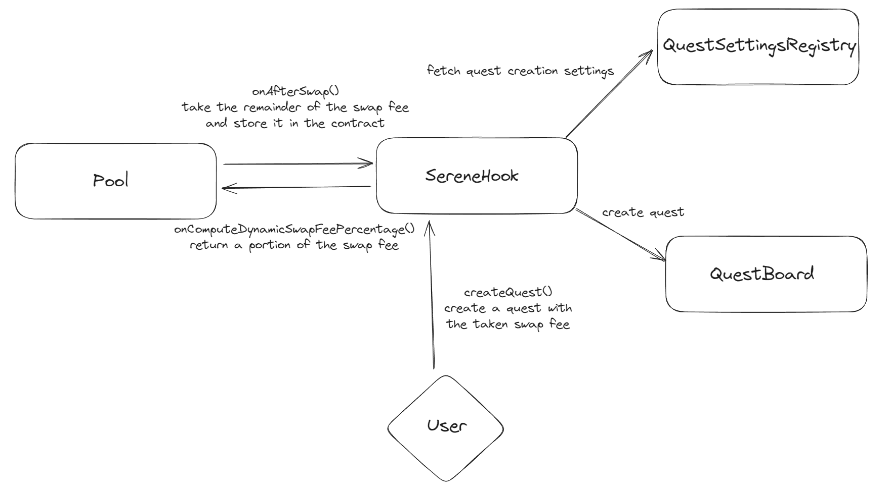

# Serene Hook

Demo video : [Serene Hook Demo](https://www.youtube.com/watch?v=-t8BABsqj3o)

## What the hook does

### Abstract

The Serene Hook provide a simple and easy way to incentive in a substainable manner the pools that use this hook. It takes a portion of the trading fees generated by the pools and create [Paladin's Quests](https://doc.paladin.vote/) to reward the liquidity provisioners with BAL emissions to the associoted pools's gauges. This enable bigger APYs for the liquidity providers and a better capital efficiency for the pools as it uses the balancer flywheel.

### Components

- `SereneHook` : The main contract that will be used by the pools to use the trading fees to incentive the liquidity providers. It implements the `onComputeDynamicSwapFeePercentage` function to keep a portion of the initial pool swap fee, and then the `afterSwap` function to take the remaininder of the initial swap fees. The last core function of the SereneHook is the `createQuest` function that will create a quest inside the Paladin's Quests contract in a permissionless way. The quests are created by swapping the fees tokens to a defined incentive token (ex WETH).
- `SereneVeBalDiscountHook` : The same hook as `SereneHook` but with a discount on the protocol swap fees for veBAL holders. The discount is applied by the `onComputeDynamicSwapFeePercentage` function, and also only impacts the fees taken after the swap by the Hook.
- `QuestSettingsRegistry` : A utility contract to store specific settings for the quest creation that will be fetched by the `SereneHook` contract. These settings are stored in a permissioned way with one settings per incentive token (ex WETH).
- `QuestBoard` : The external contract from Paladin's Quest product used to create incentive for veBAL voters to vote for the pool(s gauges.)
- `GaugeRegistry` : A mock contract used mainly to store the gauges of the pools while the balancer v3 gauge registry is being worked on.

First the users make some swaps in the pool, generating some trading fees. Then any user can call the createQuest function to create a quest in the Paladin's Quests contract. The quest will be created with the trading fees tokens swapped to the incentive token (ex WETH) and the liquidity providers of the pool will be rewarded with BAL emissions to the pool's gauge.

## Example use case

An example use case of the Serene Hook is the following:
A protocol decides to create a balancer V3 pool, he wants to attract liquidity providers to deposit into his pool. He decides to use the Serene Hook when creating his pool. To make it works, he deploy a gauge to his pool and get approved by governance. Then over the time The liquidity providers of the pool will be rewarded with BAL emissions to the pool's gauge by using the swap fees.

## Feedback about DevX

In our experience developping the Serene Hook, we found the DevX to be pretty good overall with a decent documentation and a good community support.
The cherry on top was the scaffold repository already had base tests for the hooks, which made the development process much faster and easier.
The pain points were:
- That we didn't knew exactly what were the implication of changing the onComputeDynamicSwapFeePercentage to the amounts on the afterSwap hook.
- We also had some issues to setup our tests which required a fees for the pool so we made a fork of the balancer-monorepo to change the default fees in the MockFactory.