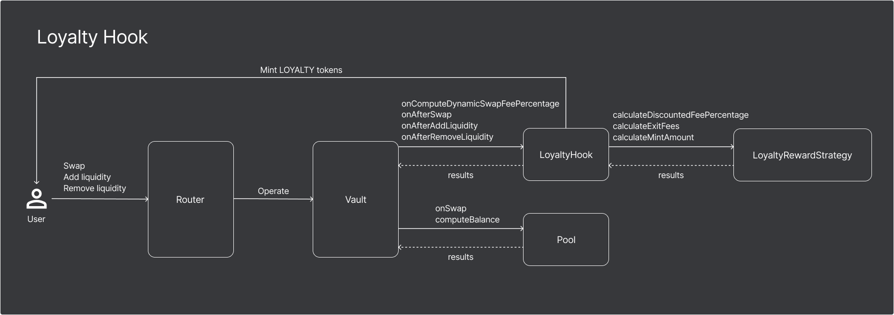

# LoyaltyHook - BAL Hookathon submission

A Balancer V3 hook designed to increase user engagement by rewarding users with loyalty tokens (`LOYALTY`) and providing dynamic fee adjustments based on their `LOYALTY` token balance.

📽 Walkthrough and demo video: https://www.youtube.com/watch?v=BkJ6-SBLb0o

## 🪧 Table of Contents

- [📖 Overview](#-overview)
- [✨ Features](#-features)
- [💎 Loyalty tiers and discounts](#-loyalty-tiers-and-discounts)
- [🛠 Architecture](#-architecture)
- [🚀 Usage](#-usage)
- [💡 Example use case](#-example-use-case)
- [🏦 Benefits](#-benefits)
- [🧪 Testing](#-testing)
- [👍 DevX feedback](#-devx-feedback)
- [🛠 Development notes](#-development-notes)
- [📌 Roadmap](#-roadmap)
- [📚 Further reading](#-further-reading)
- [📜 License](#-license)

## 📖 Overview

The **LoyaltyHook** is a custom Balancer V3 hook that enhances user engagement and loyalty by:

- Rewarding users with `LOYALTY` tokens when they interact with the pool.
- Adjusting swap and exit fees dynamically based on a user's `LOYALTY` balance.
- Implementing a modular design using a strategy pattern for flexible reward calculations.

By integrating the LoyaltyHook, liquidity pools can incentivize users to participate more actively, thereby increasing liquidity and trading volume.

## ✨ Features

### Loyalty tokens

Users earn `LOYALTY` tokens when they:

- **Add liquidity**: Incentivises users to add liquidity to the pool. Rewards are minted in proportion to the amount of liquidity added.
- **Perform swaps**: Rewards users for trading within the pool. Rewards are minted in proportion to the size of the trade. 

The amount of `LOYALTY` tokens minted is adjusted based on user activity and a decay mechanism to prevent excessive rewards.

### Dynamic swap fees

Swap fees are dynamically adjusted based on the user's `LOYALTY` token balance:

- Higher `LOYALTY` balances lead to greater fee discounts.
- Encourages users to accumulate and retain `LOYALTY` tokens.
- Fees are calculated using the `LoyaltyRewardStrategy`.

### Exit fees

When users remove liquidity:

- An exit fee is applied to discourage frequent liquidity removal.
- Users with sufficient `LOYALTY` tokens receive discounts on exit fees.
- At higher loyalty tiers, exit fees can be significantly reduced or eliminated.

### Action tracking and decay mechanism

- **Action count**: The number of actions (swaps or adding liquidity) a user performs is tracked.
- **Decay mechanism**: A decay factor reduces the `LOYALTY` tokens minted per action over time, encouraging consistent engagement rather than burst activity.
- **Reset interval**: Action counts reset after a specified interval (e.g., 30 days), allowing users to regain higher reward rates.

## 🎖 Loyalty tiers and discounts

The system uses a tiered approach to determine fee discounts based on `LOYALTY` token holdings. The implemented `LoyaltyRewardStrategy` has the following tiers:

- **Tier 1**:
  - **Threshold**: ≥ 100 `LOYALTY` tokens
  - **Discount**: 50% off swap and exit fees
- **Tier 2**:
  - **Threshold**: ≥ 500 `LOYALTY` tokens
  - **Discount**: 80% off swap and exit fees
- **Tier 3**:
  - **Threshold**: ≥ 1000 `LOYALTY` tokens
  - **Discount**: 90% off swap and exit fees

These tiers encourage users to accumulate `LOYALTY` tokens to benefit from greater discounts.


## 🛠 Architecture



The LoyaltyHook system has four main components:

### LoyaltyHook contract

The core contract that extends the pool functionality with loyalty incentive mechanisms. `LoyaltyHook` delegates calculation-intensive tasks to the `ILoyaltyRewardStrategy` implementations.

Key responsibilities:

- Tracking user actions and maintaining action counts.
- Minting `LOYALTY` tokens to users based on interactions.
- Adjusting swap and exit fees dynamically.
- Integrating with the `LoyaltyRewardStrategy` for calculations.
- **Access Control**: Has the `MINTER_ROLE` in the `LoyaltyToken` contract, allowing it to mint `LOYALTY` tokens.

### ILoyaltyRewardStrategy interface

Defines the methods that any loyalty reward strategy must implement.
This ensures that the LoyaltyHook can interact with any strategy that adheres to this interface, promoting modularity and extensibility.

```solidity
interface ILoyaltyRewardStrategy {
    function calculateDiscountedFeePercentage(
        uint256 baseFeePercentage,
        uint256 loyaltyBalance
    ) external view returns (uint256 discountedFeePercentage);

    function calculateExitFees(
        uint256[] memory baseAmounts,
        uint256 exitFeePercentage,
        uint256 loyaltyBalance
    ) external view returns (uint256[] memory adjustedAmounts, uint256[] memory accruedFees);

    function calculateMintAmount(
      uint256 baseAmount, 
      uint256 actionCount
    ) external view returns (uint256 mintAmount);
}
```
### LoyaltyRewardStrategy contract

Implements the `ILoyaltyRewardStrategy` interface and contains the logic for:

- Calculating discounted fees based on `LOYALTY` balance.
- Determining the amount of `LOYALTY` tokens to mint.
- Computing exit fees with loyalty-based discounts.

Using the strategy pattern, different reward strategies can be swapped in without modifying the LoyaltyHook contract.

### LoyaltyToken contract

An ERC20 token contract that represents the `LOYALTY` tokens rewarded to users. It incorporates OpenZeppelin's `AccessControl` for role-based permissions.

- **Minting Capability**: Allows minting of new tokens.
- **Access Control**:
  - Uses `AccessControl` to manage roles.
  - Defines a `MINTER_ROLE` for entities allowed to mint tokens.
  - The `LoyaltyHook` contract is granted the `MINTER_ROLE` to mint `LOYALTY` tokens to users.

**LoyaltyToken contract code**:

```solidity
import "@openzeppelin/contracts/token/ERC20/ERC20.sol";
import "@openzeppelin/contracts/access/AccessControl.sol";

contract LoyaltyToken is ERC20, AccessControl {
    bytes32 public constant MINTER_ROLE = keccak256("MINTER_ROLE");

    constructor(string memory name, string memory symbol) ERC20(name, symbol) {
        _grantRole(DEFAULT_ADMIN_ROLE, msg.sender);
    }

    function mint(address to, uint256 amount) public onlyRole(MINTER_ROLE) {
        _mint(to, amount);
    }

    // Function to grant minter role (can only be called by admin)
    function grantMinterRole(address minter) public onlyRole(DEFAULT_ADMIN_ROLE) {
        grantRole(MINTER_ROLE, minter);
    }

    // Function to revoke minter role (can only be called by admin)
    function revokeMinterRole(address minter) public onlyRole(DEFAULT_ADMIN_ROLE) {
        revokeRole(MINTER_ROLE, minter);
    }
}
```

## 🚀 Usage

### Deploying the contracts

1. **Deploy LoyaltyToken**:
   - Deploy the `LoyaltyToken` contract.
   - This token uses `AccessControl` to manage minting permissions.
   - The deploying account is granted the `DEFAULT_ADMIN_ROLE`.

2. **Deploy LoyaltyRewardStrategy**:
   - Deploy the `LoyaltyRewardStrategy` contract with desired parameters for tiers and decay factors.

3. **Deploy LoyaltyHook**:
   - Deploy the `LoyaltyHook` contract, providing it with the addresses of the Vault, Trusted Router, `LoyaltyToken`, and `LoyaltyRewardStrategy`.
   - The `LoyaltyHook` must be granted the `MINTER_ROLE` in the `LoyaltyToken` contract to mint tokens to users.

## 💡 Example use case

**Scenario**:

Imagine Alice, an active trader and liquidity provider, interacts with a Balancer pool that has integrated the LoyaltyHook.

1. **Adding liquidity**:
   - Alice adds liquidity to the pool.
   - The `LoyaltyHook` mints `LOYALTY` tokens to her account in proportion to the amount of liquidity she has added.
   - Her action count increases, and the decay mechanism adjusts her rewards appropriately.

2. **Performing swaps**:
   - Alice swaps tokens within the pool.
   - She earns additional `LOYALTY` tokens for each swap in proportion to the amount she has swapped.
   - Her growing `LOYALTY` balance moves her up the loyalty tiers.

3. **Receiving fee discounts**:
   - As her `LOYALTY` balance surpasses tier thresholds, she enjoys reduced swap and exit fees.
   - At Tier 2, she gets an 80% discount, significantly lowering her trading costs.

4. **Removing liquidity**:
   - When Alice decides to withdraw her liquidity, her high `LOYALTY` balance grants her reduced or waived exit fees.
   - This maximizes her returns and encourages her to continue participating in the future.

**Benefits for Alice**:

- **Lower fees**: Enhances her profitability by reducing trading and exit costs.
- **Earning rewards**: Adds value to her participation through `LOYALTY` tokens.
- **Incentivized engagement**: Aligns incentives with her interest in staying active within the pool.

## 🏦 Benefits

### For users

- **Reduced fees**: Lower swap and exit fees based on loyalty tier.
- **Rewards**: Earn `LOYALTY` tokens for interacting with the pool.
- **Incentives**: Encourages consistent engagement with the pool.

### For pool creators

- **Increased engagement**: Incentivizes users to interact more, increasing liquidity and trading volume. Offering loyalty rewards can attract more users to the pool.

## 🧪 Testing

Extensive testing has been carried out to ensure the reliability and accuracy of the LoyaltyHook. The tests cover various scenarios to validate the functionality of the contracts. The test suite is implemented in the `LoyaltyHookTest`` contract using Foundry.

Tests include:

- **Swap operations**:
  - Swaps without any `LOYALTY` balance to ensure standard fees apply.
  - Swaps with varying `LOYALTY` balances to verify fee discounts are correctly applied.
  - Verification of correct token balances before and after swaps.

- **Liquidity provision**:
  - Adding liquidity and verifying that `LOYALTY` tokens are minted appropriately.
  - Testing the decay mechanism by performing multiple liquidity additions and checking the reduced minting amounts.

- **Exit fees**:
  - Removing liquidity and ensuring that exit fees are calculated based on `LOYALTY` balances.
  - Confirming that the exit fees are correctly distributed back to the pool or LPs.

- **Action count reset**:
  - Testing that the action count for users resets after the specified interval (e.g., 30 days).
  - Ensuring that after the reset, users receive full minting amounts without accumulated decay.

## 👍 DevX Feedback

Developing the LoyaltyHook provided valuable insights into the Balancer V3 ecosystem. Here are some observations:

### Positive aspects:

- **Comprehensive documentation**: The Balancer documentation is excellent, with sample hooks that were instrumental in understanding the hook system. Many of the tests and mechanisms in the LoyaltyHook were based on these examples.

- **Deploy scripts**: The provided deploy scripts were very helpful. They enabled seamless deployment of the pool and LoyaltyHook, and facilitated interaction with the frontend effectively.

- **Interactive frontend**: The frontend offered a practical environment to test and interact with custom contracts, making the development and debugging process more efficient.

### Suggestions

- **Documentation consistency**: Some of the documentation is spread across the `scaffold-balancer-v3` repository and the official documentation site, which was discovered late in the development process. Unifying the documentation by consolidating resources and examples in one place would enhance accessibility.

### Overall experience

Developing the LoyaltyHook has been a rewarding experience that demonstrates the flexibility and power of the Balancer V3. The ability to customise pool behaviour through hooks opens up possibilities for innovation in DeFi. The supportive documentation and tools provided made the development process smooth and enjoyable.

## 🛠 Development notes

### Extensibility

- **Strategy pattern**: By using the `ILoyaltyRewardStrategy` interface, new strategies can be developed and integrated without changing the LoyaltyHook.
- **Changeable parameters**: The owner can update tiers, decay factors, and fee percentages to adapt to changing market conditions.

## 📌 Roadmap

The tokenised loyalty mechanism paves the way for extending LoyaltyHook's functionality to external systems. Future enhancements may include

- **Staking**: Allow users to stake `LOYALTY` tokens to earn additional rewards or exclusive benefits.
- **Governance**: Allow `LOYALTY` holders to participate in decision-making processes for the pool.
- **Cross-platform integrations**: Leverage `LOYALTY` tokens on other DeFi platforms to increase their value.
- **Gamification**: Introduce milestones and badges to further incentivise user engagement.

## 📚 Further reading

For more information on the Balancer v3 architecture, hooks, and a detailed breakdown of the LoyaltyHook, please see to the following articles:

- [Building a Balancer hook: Part 1 - Introduction to Balancer v3 and hooks](https://chainkraft.com/building-a-balancer-hook-part-1/)
- [Building a Balancer hook: Part 2 - LoyaltyHook](https://chainkraft.com/building-a-balancer-hook-part-2/)

## 📜 License

This project is licensed under the MIT License.

# Thank you!

Thank you for considering the **LoyaltyHook** for the BAL Hookathon! I appreciate your time and look forward to any feedback or questions you may have.

---

*This hook is a submission for the BAL Hookathon and aims to demonstrate the potential of customizable hooks in enhancing user engagement and value within the Balancer ecosystem.*
