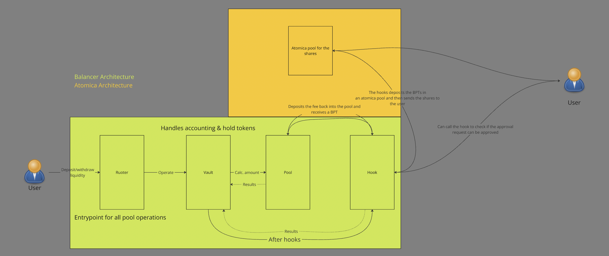

# Insurance Premium Hook

Insurance is crucial for new or high-risk protocols in DeFi to provide coverage in the event of failures or other risks. However, for the insurance to be effective, a premium must be paid to the insurer. This hook collects a fee when liquidity is added or removed proportionally, and uses it to pay the insurance premium.

Currently, the hook does this:
1. Takes a fee when the addition/removal of liquidity is proportional¹
2. Uses the fee to add liquidity back and receives a BPT
3. Deposits the BPT into an [atomica pool](https://www.atomica.org/), since an atomica pool is basically an ERC4626, the user will receive the shares of the atomica pool, essentially wrappedBPTs
4. The hook will also work as an outflow processor for the atomica pool, it will determine permissionlessly if a user can be granted an outflow request based on when he deposited, this is decided based on when the premium was deposited, if the premium was deposited more than 10 days ago, then the request is approved, otherwise it is rejected².

¹ It needs to be proportional because of how the hooks work now, as of now, from the current documentation there seem to be no way of receiving directly the bpts as fee, and using an unproportional amount of tokens would require the hook to receive the fee as bpts

² For example this is done to insure that no predatorial funds can come in and claim, an insurance refund on a stablecoin after it has already depegged.

# Roadmap

For now this is more of a proof of concept and can be improved upon greatly.
The improvements are:
Phase 1: (we are currently in this phase) Present the idea on the hackaton and see if it has traction.
Phase 2: Improve the calculation of the fee from a static fee decided by an owner to a dynamic fee that is calculated based on how much insurance is needed for the pool
Phase 3: Improve the permissionaless side of the hook and make it act as an outflow processor also for the insurer side (right now is being an outflow processor only for the user)
Phase 4: Being able to receive directly BPTs (so even liquidity that is added or removed not proportionally) and being able to insure also only 1 of the tokens of the pool

Pool Lifecycle Implementation Point - Pool Lifecycle Implementation Point, onAfterAddLiquidity