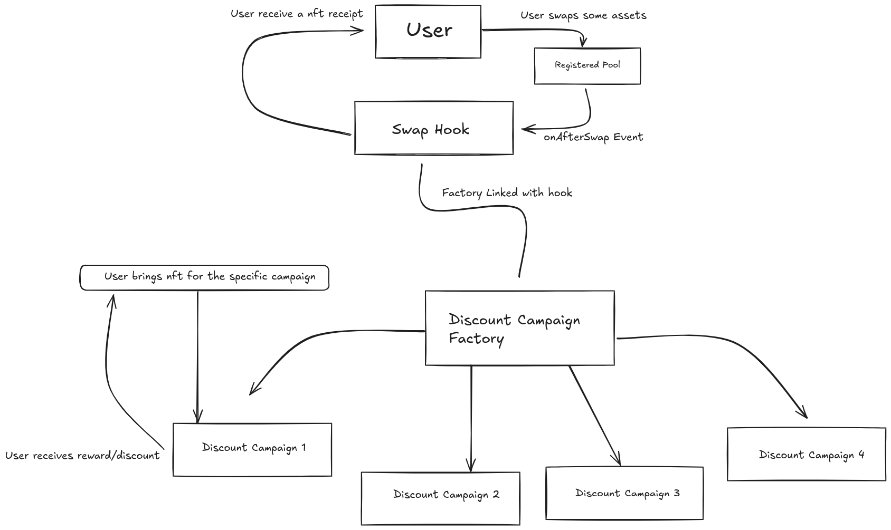
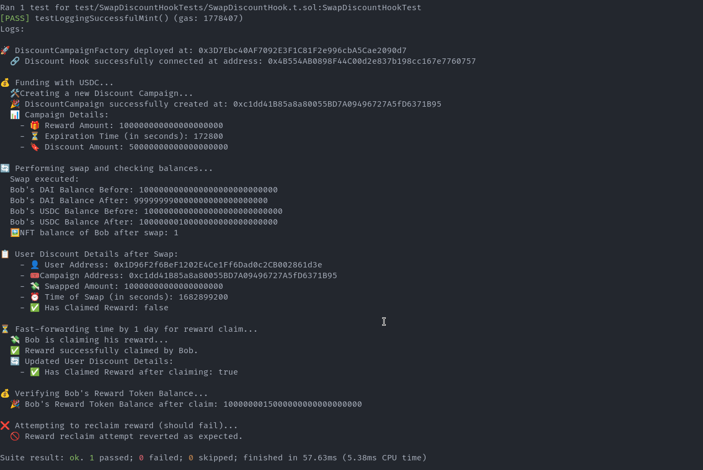

# Swap Bond Hook



Swap bond hook is a swap discount utility based hook that equips the pools on balancer v3 to create native incentive campaigns on after swap callback. Projects launching their pools can provide incentives to people buying their token through an incentive campaign in which the token buyers will get a bond nft that represents their buy value. The buyers can redeem reward tokens from the discount campaign based on the value of the token bought.

This contraption will help project attract volume without relying on the 3rd party incentive products and within the safe boundaries of Balancer v3.

# Pool Life Cycle Points

This hook primarily uses onRegister and onAfterSwap callback:

- onRegister: During the onRegister callback, the hook gets connected with a pool created.
- onAfterSwap : When a user buys the project token, the hook catches the state of the swap in onAfterSwap callback and writes this state against the bond nft id in the discount campaing contract, Finally it mints the bond nft to the user.

# Example Use Cases

Suppose Project X is launching XT token on Balancer v3, the project is relatively new and wants to bring volume to the pool. Instead of doing the airdrops or relying on a 3rd party incentive protocol, they integrate the swap bond hook with XT/ETH pool. They create a a campaign of 5000 XT tokens as a reward on 50% initial dynamically decreasing discount on the max trade of 200 XT tokens with a cooldown period of 3 days on reward claim.

This way, the project can essentially create an incentive opportunity for their users while also bringing volume to the project which can kickstart the tokenomics if done right.

This hook is not only for the new pools but the projects can utilise this layer at any stage of their project to invite the influx of token holders.

### Local Test Demo

Video: https://youtu.be/y_DcclWcuHk

# Discount Formula

For the campaign discount we have opt for a dynamically decreasing discount formula. The projects set an initial discount rate with a deterministic quantity of rewards. The discount rate decreases as the users start redeaming the rewards. Whoever avails the discount first gets a better % as compared to the next user. The update formula demostrate it below.

```
function _updateDiscount() private {
        campaignDetails.discountRate =
            (_maxDiscountRate * (campaignDetails.rewardAmount - tokenRewardDistributed)) /
            campaignDetails.rewardAmount;
    }
```

# Calculations of user claimable reward

```
function _getClaimableRewards(UserSwapData memory userSwapData) private view returns (uint256 claimableReward) {
        uint256 swappedAmount = userSwapData.swappedAmount;

        // Calculate claimable reward based on the swapped amount and discount rate
        if (swappedAmount <= _maxBuy) {
            claimableReward = (swappedAmount * campaignDetails.discountRate) / 100e18;
        } else {
            claimableReward = (_maxBuy * campaignDetails.discountRate) / 100e18;
        }
    }

```

# Intended Project Interaction

### For Projects

- Create a pool on balancer v3.
- Register `SwapDiscountHook` with the pool
- Create a campaign by interacting with `DiscountCampaignFactory` contract and transfer the reward tokens to the campaign.

### For Users

- Buy Project token on Balancer v3 and get the Bond nft as early as possible to avail the maximum discount.
- Wait for the cooldown period to end.
- Visit the campaign interface and redeem the reward against their bond nft.

## Code Review


## Challenges

Since Hook based architecture among the Dexes is a fairly new and untested idea as there is no practical example on mainnet. It's uncertain to know from the user experience perspective if it will be adopted widely and how easy it will be for the people to integrate the applications or hooks built on top of the dexes in their daily crypto usage.

While building the swap bond hook, we also had some questions related to how much control should a a project must have on the emission of rewards while making a campaign. It both depends on the tokenomics of that individual project and how much control they would like to have on their emissions.

There is ofcourse a room of improvement as the hook goes into the hands of people and projects.

## Running Tests



Run the Foundry tests

```
yarn test

```

## Authors

- [@anassohail99](https://www.github.com/anassohail99)
- [@Mubashir-ali-baig](https://github.com/Mubashir-ali-baig)
